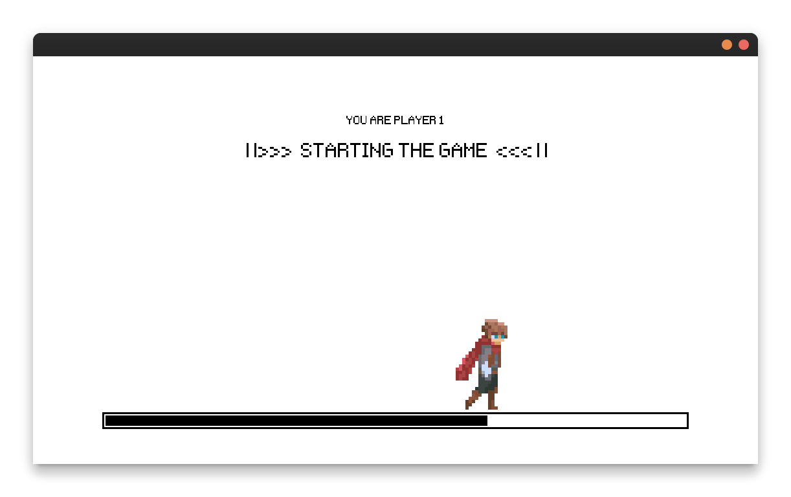
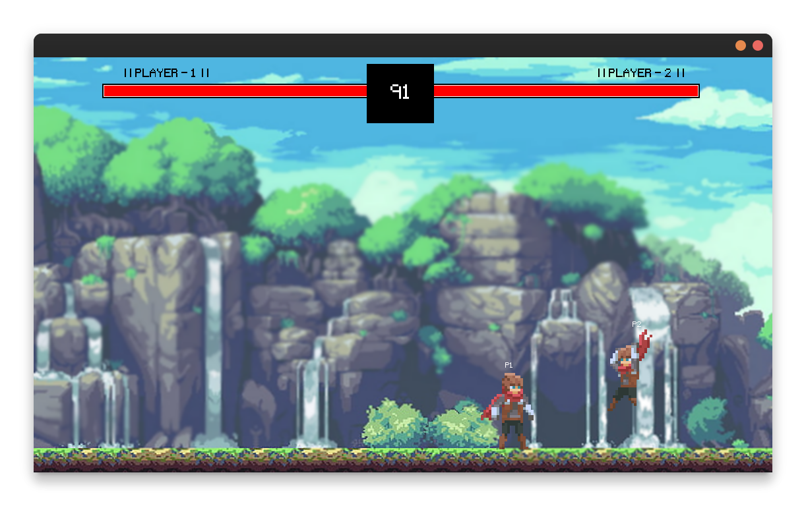
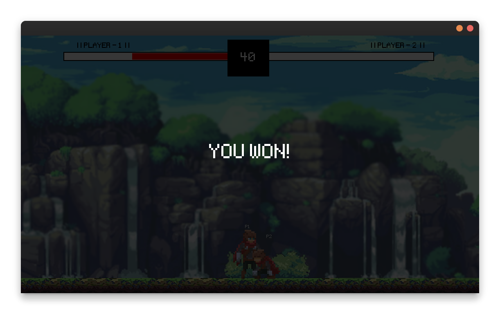

# 2PFG - 2 Player Fighter Game
A 2 player 2D Fighter Game built in python 

<br>

## Insallation
1. Clone the repository to your local machine

``` bash
git clone https://github.com/bakayu/2PFG.git
cd 2PFG
```
2. Required dependencies can be found in [requirements.txt](requirements.txt), run the following code to install them on your machine/python envrionment

``` bash
pip install -r requirements.txt
```
<br>

## Usage
___Note:___ Before running the game, the following code should be executed inside the game folder to ensure the clients connect to the server as intended.

``` bash
python3 getip.py
```

Additionally, run the following code should be executed on the machine running the server.

``` bash
python3 server.py
```

Finally, run the following code in both the computers to launch the Client (they should be connected to the same network/WIFI).

``` bash
python3 client.py
```

### Controls
 - w/SPACE - jump
 - d - move right
 - a - move left
 - j - punch
 - k - kick
 - l - dash

<br>

## Preview





